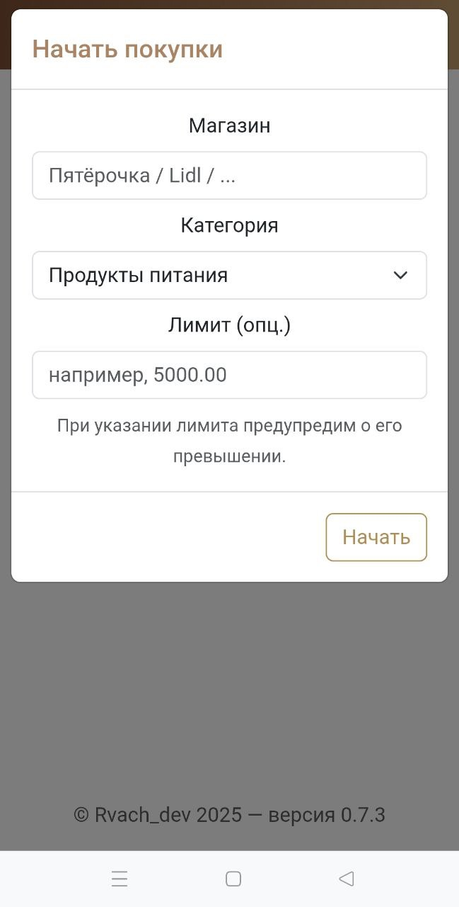

# Tratometr — учёт расходов (PHP 7.4+ / Yii2 / MySQL / Docker)

Домашний учёт расходов с категориями/тегами и базовыми отчётами.  
Быстрый локальный запуск через Docker Compose, миграции и (опционально) сид-данные.

## Стек
- PHP 7.4+ (Yii2)
- MySQL
- Docker + docker compose
- Nginx

---

## Быстрый старт (локально)

1) Клонирование

```cmd
git clone https://github.com/<user>/Tratometr.git
cd Tratometr
```

2) Переменные окружения

```cmd
copy .env.example .env
```
Отредактируйте `.env` при необходимости (имя БД/пользователь/пароль).

3) Запуск сервисов

```cmd
docker compose up -d --build
```

4) Применение миграций

```cmd
docker compose exec php php yii migrate --interactive=0
```

5) (Опционально) сид-данные

```cmd
docker compose exec php php yii seed/init
```

6) Открыть приложение

`http://localhost:8080`  *(порт смотрите в `docker-compose.yml`)*

### Демо-флоу (30 секунд)
1. Создайте закупочную сессию.
2. При желании введите лимит на сумму.
3. Отсканируйте любой ценник, чек или ввведите сумму вручную.
4. Закройте сессию сохранив данные.
5. Откройте вкладку статистики или истории.

---

## Конфигурация

### `.env.example`

```env
DB_HOST=mysql
DB_PORT=3306
DB_NAME=tratometr
DB_USER=tratometr
DB_PASS=secret

APP_ENV=local
APP_DEBUG=1

# Безопасный доступ к служебным экшенам (см. раздел «Администрирование»)
ADMIN_BASIC_USER=admin
ADMIN_BASIC_PASS=change_me
MIGRATE_ENABLE=0
LOG_VIEW_ENABLE=0
```

### `config/db.php` (пример)

```php
<?php
return [
    'class' => 'yii\db\Connection',
    'dsn' => 'mysql:host=' . getenv('DB_HOST') . ';port=' . getenv('DB_PORT') . ';dbname=' . getenv('DB_NAME'),
    'username' => getenv('DB_USER'),
    'password' => getenv('DB_PASS'),
    'charset' => 'utf8mb4',
];
```
---

## Администрирование (безопасный доступ)

> В продакшене по умолчанию отключено. Включайте только временно и **только** с basic-auth.

- Просмотр логов (`/log/webhook`, `/log/webhook-error`) — включается `LOG_VIEW_ENABLE=1` + `ADMIN_BASIC_USER/ADMIN_BASIC_PASS`.
- Триггер миграций через веб (`/log/migrate`) — включается `MIGRATE_ENABLE=1` + basic-auth; после использования **отключить**.

*(Любые реальные ключи/ссылки/адреса — только в приватной вики или в переменных окружения, не в репозитории.)*

---

## Деплой на Railway (общее, без привязки к инфраструктуре)

1) Создайте проект и добавьте **MySQL**.
2) В Variables задайте `DB_HOST/DB_PORT/DB_NAME/DB_USER/DB_PASS`.
3) Соберите образ из `Dockerfile`. Команда запуска может применять миграции и стартовать сервер:

```dockerfile
CMD php yii migrate --interactive=0 && php -S 0.0.0.0:8080 -t web
```

4) Отключите модули Yii **gii** и **debug** для `APP_ENV=prod`.

> Конкретные хосты, порты и CI/CD остаются на вашей стороне.

---

## Архитектура (кратко)

- **Основные таблицы:** `purchases`, `categories`, `tags`, `purchase_tag`.
- **Индексы:** по `date`, `category_id` (ускорение выборок и отчётов).
- **Миграции:** в `migrations/`, применяются командой из раздела «Быстрый старт».
- **Отчёты:** по периодам и категориям.

---

## Скриншоты

Добавьте 1–2 PNG в папку `assets/` и вставьте сюда:

```text



```

---

## Roadmap / Known limitations
- [ ] Per-item скидки
- [ ] Экспорт в CSV
- [ ] Авторизация по токену
- [ ] Массовый импорт из CSV/XLSX
- [ ] Больше отчётов и фильтров

---

